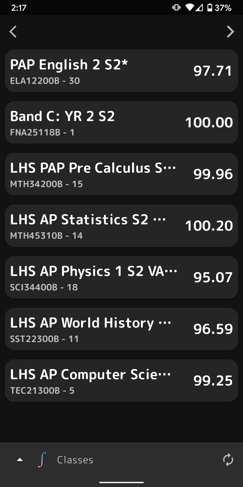
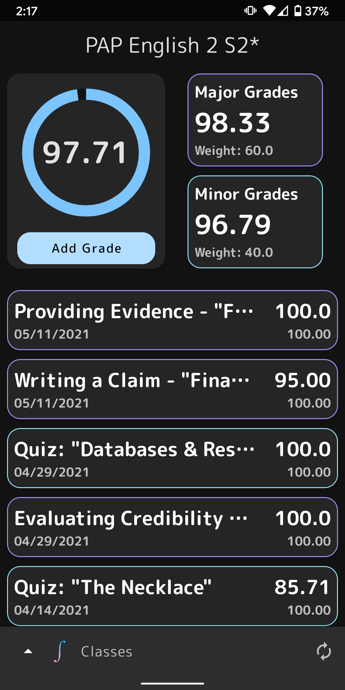
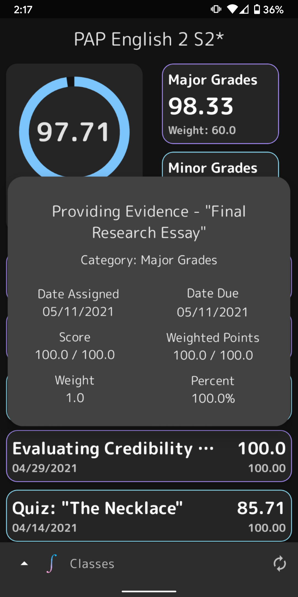
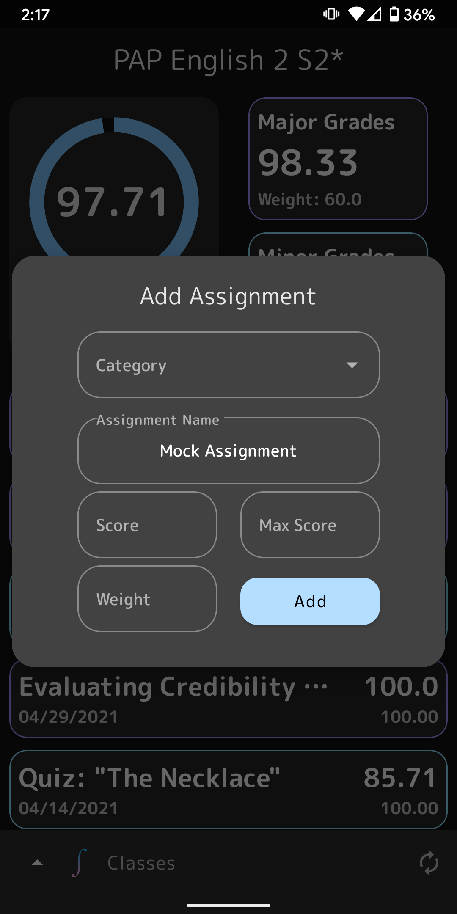
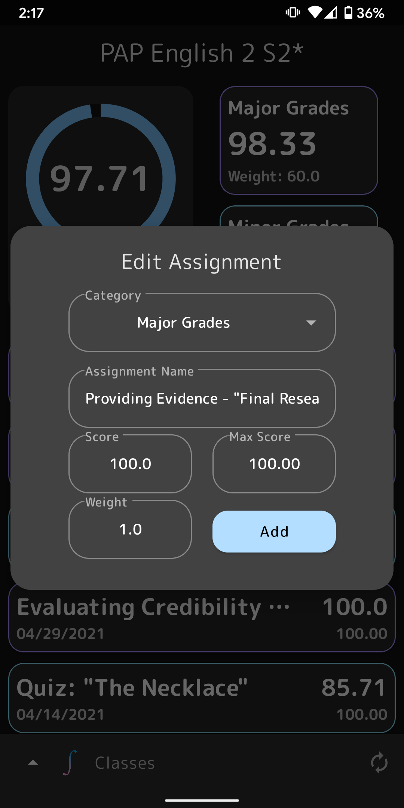

# Projekt Sarona - SimpleGrade

## Summary 
An Android grade-fetching app made with Kotlin. The app fetches student grades from the Home Access Center (HAC) and displays them in a clean and simplified format.

## Further Details
- Data collection is powered by my [HAC API made with Python+Flask](https://github.com/Phytal/HomeAccessCenter-Flask-API) and is stored locally on the device, allowing for offline usage.

- Includes a Light and Dark theme design.

- Navigation Fragment Design adapted from Google's [Reply App](https://github.com/material-components/material-components-android-examples/tree/develop/Reply).

## Screenshots 

## Credits
- [William Zhang](https://www.linkedin.com/in/william-zhang-452141191/) ([Phytal](https://github.com/Phytal)) - Creator and Designer
